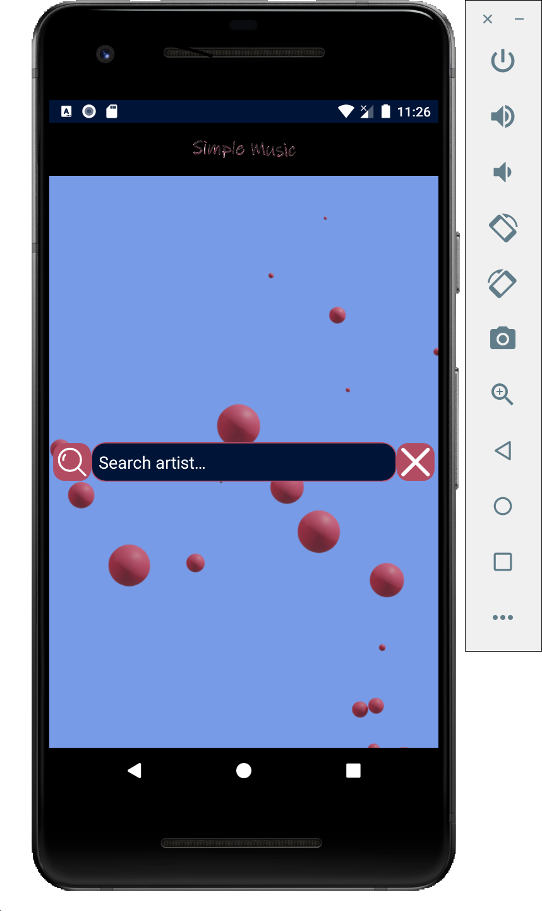
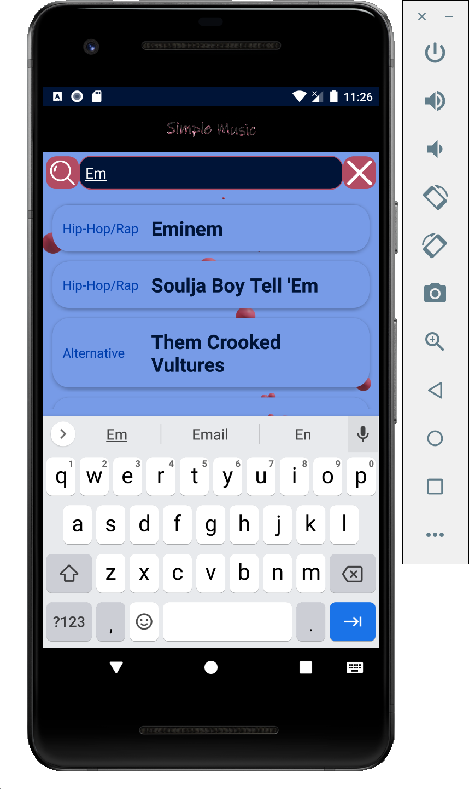
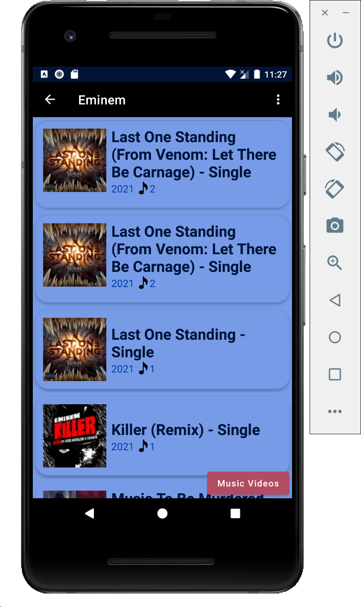
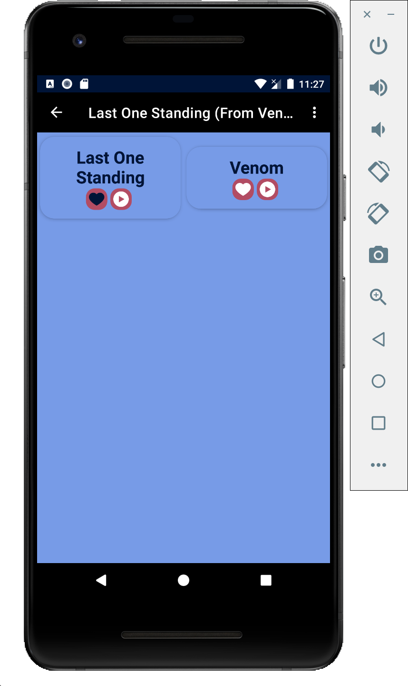
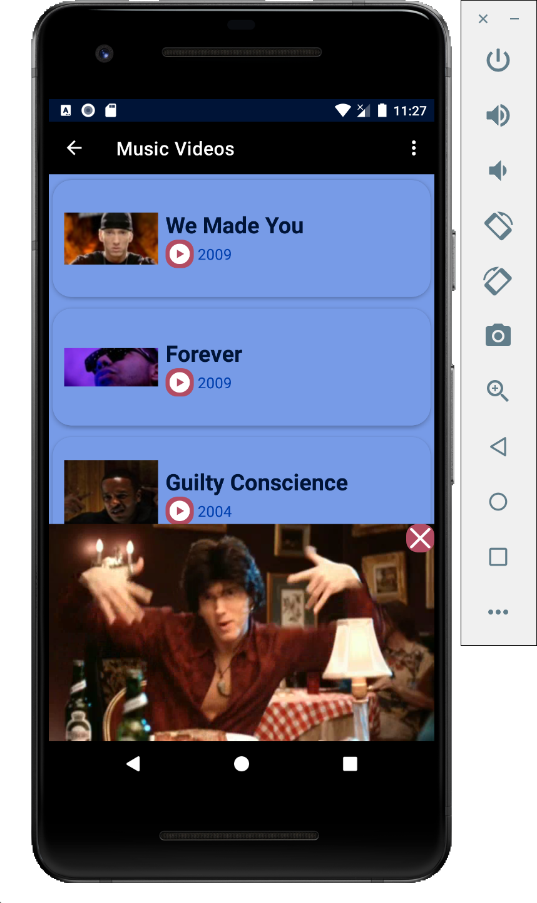

# Simple Music
Just a simple Android app to search artist and explore music.

# Android API
* API 26 (Android 8)
* Tested API 21, 26, 30, 31

# Features
* Search bar for musical artists
* Explore albums
* Explore songs
* Explore music videos
* Play music videos, songs and share them
